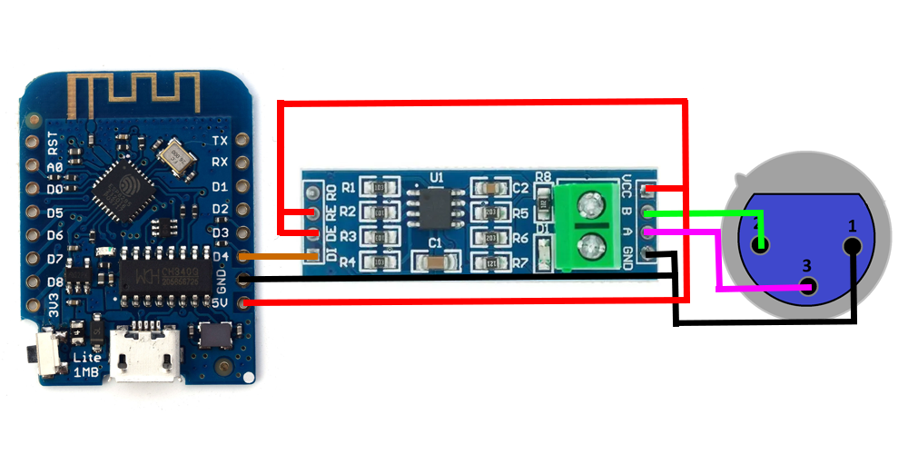
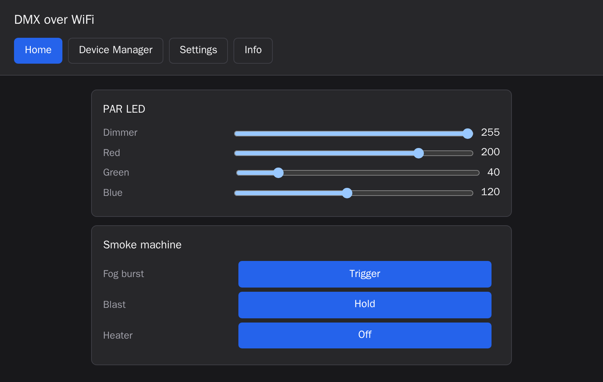
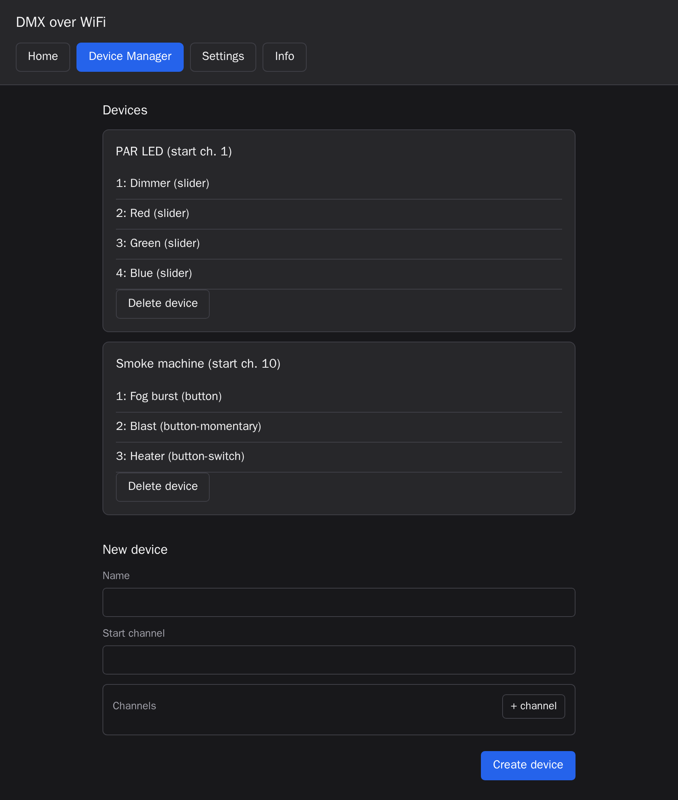
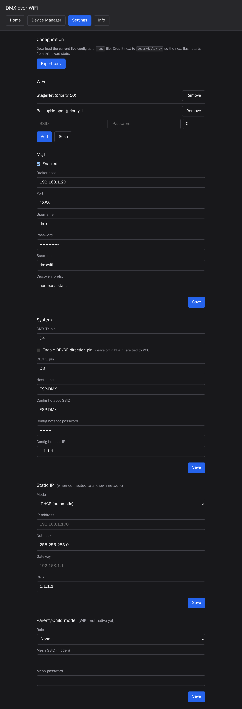
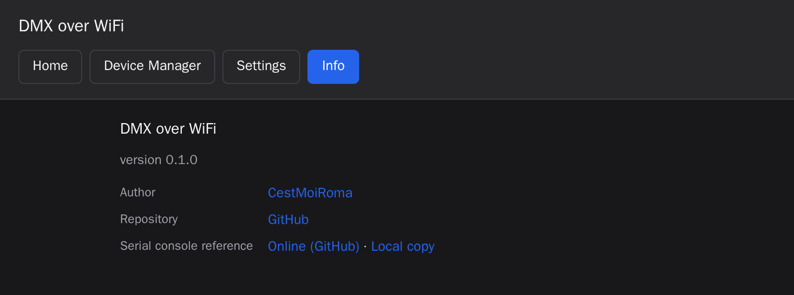

# DMX over WiFi (Mark II)

[](https://github.com/CestMoiRoma/DMXoverWifi/actions/workflows/tests.yml)
[](LICENSE)

A standalone DMX512 transmitter you configure and drive from a web browser. It
runs CircuitPython on an ESP32 board, serves its own web UI, remembers several
WiFi networks, falls back to its own hotspot when none are in range, and can
expose every DMX channel to Home Assistant over MQTT.

> [!NOTE]
> **This is a full rewrite of my earlier [ESPDMX](https://github.com/CestMoiRoma/ESPDMX)
> project**, the "MKII" that was on that project's roadmap. None of the old
> Arduino and ESP8266 firmware is reused. The WebSocket-only control scheme is
> gone, replaced by a web UI, a REST API, an MQTT bridge and a serial console.
> Only the electrical design carries over.

## Contents

- [What it does](#what-it-does)
- [Hardware](#hardware)
- [Wiring](#wiring)
- [Getting started](#getting-started)
- [The web UI](#the-web-ui)
- [Channel types](#channel-types)
- [Timing and latency](#timing-and-latency)
- [Testing](#testing)
- [Repository layout](#repository-layout)
- [Documentation](#documentation)
- [Roadmap](#roadmap)
- [License](#license)

## What it does

| | |
|---|---|
| **DMX output** | A full 512-channel universe, refreshed roughly 40 times a second, generated over UART with a proper break and mark-after-break |
| **Web UI** | Four pages served straight off the board: live control, fixture editor, settings, and an info page |
| **Fixtures and channels** | Group DMX addresses into named fixtures. Each channel is a fader or one of three kinds of button |
| **Multi-network WiFi** | Save several networks with priorities, so the same box works at home, at the venue and on tour |
| **Config hotspot** | With no known network in range the board starts its own access point, so the UI is always reachable |
| **Static or DHCP** | Take whatever address the router hands out, or pin a fixed one |
| **MQTT and Home Assistant** | Optional. Publishes auto-discovery configs, so every channel turns up as a `number`, `switch` or `button` entity |
| **Serial console** | A full text command set over USB. Configure, inspect and reboot the board without a browser |
| **Off-board test suite** | 243 tests that run the firmware on a PC against a fake ESP32, so a change can be checked before it is flashed |
| **Parent and child mesh** | Present in the UI and the settings store. **Work in progress: stored only, no radio behaviour yet** |

## Hardware

- **An ESP32-family board that runs CircuitPython.** Developed and tested on a
  **Wemos / Lolin S2 Mini** (ESP32-S2, CircuitPython board id `lolin_s2_mini`,
  4 MB flash and 2 MB PSRAM).
- **A MAX485 or similar RS-485 breakout**, the common blue module with
  `RO DI DE RE` down one side and `VCC A B GND` down the other.
- **A 3-pin or 5-pin female XLR** for the DMX output.
- A USB cable, and 5 V for the MAX485.

Output only for now. `RO` stays unconnected, so there is no DMX input and no RDM.
Changing that is the first item on the [roadmap](#roadmap).

## Wiring



> [!IMPORTANT]
> **The board in this picture is a Wemos D1 Mini, which is an ESP8266.** It comes
> from the original ESPDMX project and is kept here because the RS-485 side of
> the circuit is identical. **This repository does not run on an ESP8266.** It
> needs an ESP32 board running CircuitPython, as listed under
> [Hardware](#hardware). Wire the MAX485 exactly as shown, but take the signals
> from your ESP32's pins and set the matching pin names in the UI or over serial.

### Connections

| Microcontroller | MAX485 | Notes |
|---|---|---|
| `D4` (configurable) | `DI` | The DMX data line. This is the **DMX TX pin** setting, `D4` by default |
| `5V` | `VCC` | |
| `GND` | `GND` | |
| not wired | `DE` + `RE` | Tied together **to VCC** in this schematic, so the transceiver always transmits |
| not wired | `RO` | Transmit only, so nothing to receive |

| MAX485 | XLR pin | DMX signal |
|---|---|---|
| `GND` | 1 | Shield and common |
| `B` | 2 | Data minus |
| `A` | 3 | Data plus |

### About the DE/RE pin

The schematic ties `DE` and `RE` straight to VCC, so the transceiver always
transmits and the microcontroller has nothing to drive. That is the default in
this firmware, with `dmx_dir_pin_enabled` set to `false`.

If your wiring routes `DE` and `RE` to a GPIO instead, enable the direction pin
and name it:

- in the UI, under **Settings**, **System**, **Enable DE/RE direction pin**
- over serial, with `Set-System dir-pin enable=true pin=D3`

Either way, reboot the board for a pin change to take effect.

## Getting started

### 1. Flash CircuitPython

Install CircuitPython on your ESP32 board. On the Lolin S2 Mini: hold `0`, tap
`RST`, then drop the `.uf2` on the bootloader drive that appears. The board then
shows up as a `CIRCUITPY` mass-storage volume.

### 2. Get the code

```bash
git clone https://github.com/CestMoiRoma/DMXoverWifi.git
cd DMXoverWifi
pip install pyserial
```

Python 3 and pyserial are all the tooling needs. There is no build step.

### 3. Optional: preload your settings

Copy `.env.example` to `.env` and fill in whatever you want the board to start
with: WiFi networks, MQTT broker, DMX pins, even a first set of fixtures. The
deploy script seeds them onto the board so a fresh flash is already configured.
`.env` is gitignored, because it holds passwords in clear text.

Skip this and set everything up through the UI instead.

### 4. Deploy

```bash
python tools/deploy.py
```

It asks where the `CIRCUITPY` drive is mounted, then copies `boot.py`, `code.py`,
`src/`, `www/` and the vendored `lib/` across. Your saved config under `data/` is
left alone.

Once the firmware has run at least once, the board owns the filesystem and the
drive is read-only from the PC. The script handles that by itself: it asks which
serial port the board is on, ejects the drive, reboots the board into config
mode, copies the files, then reboots it back to normal. See
[WIKI.md](WIKI.md#filesystem-write-access) for what that does and why.

### 5. Get it on the network

With no saved network, the board starts its own hotspot:

| | |
|---|---|
| SSID | `ESP-DMX` |
| Password | `DMX4ALL1` |
| Address | <http://1.1.1.1> |

Join it, open the page, go to **Settings**, **WiFi**, press **Scan**, add your
network and reboot. From then on the board joins that network at boot and the UI
lives at whatever address it gets.

The serial console does the same thing in one line:

```
Add-Wifi ssid="My Network" passwd="hunter2" priority=10
```

### 6. Add a fixture

Open **Device Manager**, give the fixture a name and a DMX start channel, then
add its channels. A channel's *offset* is relative to the start channel, so a
fixture starting at 10 with a channel at offset 3 drives DMX address 12. Its
controls then appear on **Home**.

## The web UI

### Home

Every configured fixture, with the right control per channel. Moving a fader
writes the DMX buffer straight away.



### Device Manager

Create, inspect and delete fixtures. Channels take an offset, a name and a type.



### Settings

Saved networks with priorities and a scanner, the full MQTT and Home Assistant
configuration, DMX pin assignments, hotspot credentials, static IP settings, and
the work-in-progress parent and child section.



### Info

Firmware version, author, repository, and the serial console reference. The wiki
link works offline too, because the deploy script drops a copy of `WIKI.md` on
the board.



> Screenshots come from the test suite's mock board, so they show demo fixtures
> rather than anyone's real rig. Regenerate them with
> `docker compose -f test/docker-compose.yml run --rm screenshots`.

## Channel types

Every channel picks one of four behaviours, set in Device Manager or over serial
with `mode=`.

| Type | On the Home page | Sends | In Home Assistant |
|---|---|---|---|
| `slider` | A 0 to 255 fader | The fader value | `number` |
| `button` | A **Trigger** button | 255 on each press | `button` |
| `button-momentary` | A **Hold** button | 255 while held, 0 on release | `button` |
| `button-switch` | An **On** and **Off** toggle | 255 or 0, latching | `switch` |

Use `slider` for dimmers and colour mixing, `button` for a one-shot like a fog
burst, `button-momentary` for anything that should stop when you let go, and
`button-switch` for things that stay on, like a heater or a lamp relay.

Over serial the mode accepts the obvious synonyms, so `momentary`, `hold`,
`toggle` and `switch` all land on the right type.

## Timing and latency

> [!WARNING]
> **Latency is not guaranteed.** The delay between moving a fader and the fixture
> reacting varies, and it can occasionally spike well past what feels acceptable
> for live work. Do not use this box where a late or dropped cue matters: pyro,
> moving trusses, anything safety related, or a show that has to hit an exact
> musical beat.

Where the jitter comes from:

- **WiFi is best effort.** Retries, interference, a busy access point or a
  roaming client each add tens to hundreds of milliseconds, unpredictably. Put a
  broker and Home Assistant on top and the tail gets longer.
- **One cooperative loop.** `code.py` polls the HTTP server, the MQTT client, the
  DMX refresh and the serial console in a single `while True`. Nothing preempts
  anything, so a slow request delays the next DMX frame.
- **CircuitPython is interpreted**, with a garbage collector that can pause the
  loop at any moment.
- **The DMX frame itself is software timed.** The break is generated by
  reconfiguring the UART, and the 25 ms refresh happens whenever the loop next
  comes round and enough time has passed, rather than on a timer interrupt.

What is dependable: once a value reaches the DMX buffer it keeps going out at
roughly 40 frames a second, so fixtures hold their state and do not flicker. It
is the *arrival* of a new value that has no deadline.

If you need deterministic timing, drive your rig from a real lighting desk or an
Art-Net or sACN node on a wired network.

## Testing

The firmware runs on a PC, against a fake ESP32, so nothing needs flashing to be
checked.

```bash
docker compose -f test/docker-compose.yml run --rm tests
```

That covers config persistence, DMX frame generation, fixtures and channels, WiFi
priority and hotspot fallback, MQTT discovery and command handling, every serial
command, every HTTP route, boot-time filesystem ownership, and the whole stack
wired together the way `code.py` wires it. It also drives the real web UI in a
headless browser against a mock board.

Without Docker:

```bash
pip install -r test/requirements.txt
python -m pytest test -v
```

See [test/README.md](test/README.md) and [WIKI.md](WIKI.md#test-suite).

## Repository layout

```
boot.py                 Picks which side owns the filesystem at boot
code.py                 Wiring-up and the main loop
settings.toml           CircuitPython environment, empty by default
.env.example            Template for preloading settings at deploy time

src/
  dmx_driver.py         512-channel buffer, break generation, 40 fps refresh
  devices.py            Fixture and channel model, persistence, DMX addressing
  web_server.py         HTTP routes: the static UI plus the JSON API
  wifi_manager.py       Saved-network database, priority connect, AP fallback
  mqtt_manager.py       MQTT client and Home Assistant auto-discovery
  serial_console.py     USB serial command interpreter
  settings_store.py     JSON config files under /data, with defaults
  version.py            Firmware version, shown on the Info page

www/                    The web UI, plain HTML, CSS and JS, no build step
lib/                    Vendored CircuitPython libraries
data/                   Runtime config written by the board, gitignored

tools/
  deploy.py             Sync firmware to CIRCUITPY, unlocking it if needed
  serial_console.py     Interactive serial terminal

test/
  fake_esp32/           Stand-ins for the CircuitPython hardware modules
  ui/                   Mock board and UI screenshot tooling
  Dockerfile            The test pipeline image

docs/images/            Wiring schematic and UI screenshots
```

Config lives in `/data/*.json` on the board and is gitignored, because it holds
your WiFi and MQTT passwords in clear text.

## Documentation

**[WIKI.md](WIKI.md)** is the full reference:

- every serial command, with arguments and examples
- opening a serial session, and the deploy procedure
- how filesystem write access works
- the HTTP JSON API
- MQTT topics and Home Assistant discovery
- the test suite and the fake hardware layer
- troubleshooting

**[CONTRIBUTING.md](CONTRIBUTING.md)** covers the pull request workflow.

## Roadmap

Working today: DMX output, the web UI, the fixture model, multi-network WiFi,
hotspot fallback, static IP, MQTT with Home Assistant discovery, the serial
console, the deploy tooling and the test suite.

Planned:

- **DMX input.** Wire `RO` and a direction pin so the board can *receive* a
  universe from a real lighting desk instead of only generating one. The point is
  the parent role below: one box patched into the desk, reading DMX and relaying
  it over WiFi to the child nodes, which output it locally. That turns the
  project into a wireless DMX distribution system rather than a standalone
  controller.
- **Parent and child mesh.** The UI, the serial command and the stored settings
  exist, but nothing acts on them yet.
- **Authentication.** There is none on the web UI or the API today, so keep the
  board on a network you trust.

## License

[PolyForm Noncommercial 1.0.0](LICENSE). In plain terms:

- **Noncommercial use is free**, including by schools, charities and public
  bodies.
- **Forks and modifications are welcome**, as long as the licence and the
  copyright notice travel with them, so credit stays attached.
- **Commercial use needs an agreement.** Open an issue and ask.

Contributions go through pull requests, and are licensed under the same terms.
See [CONTRIBUTING.md](CONTRIBUTING.md).

## Credits

Successor to [ESPDMX](https://github.com/CestMoiRoma/ESPDMX) by
[CestMoiRoma](https://github.com/CestMoiRoma). The wiring diagram comes from that
project.
