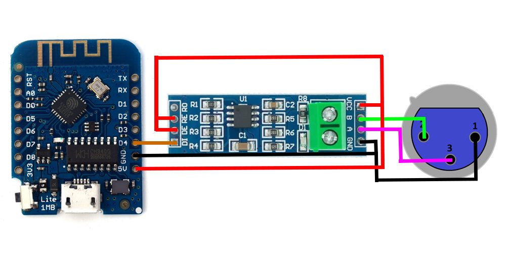
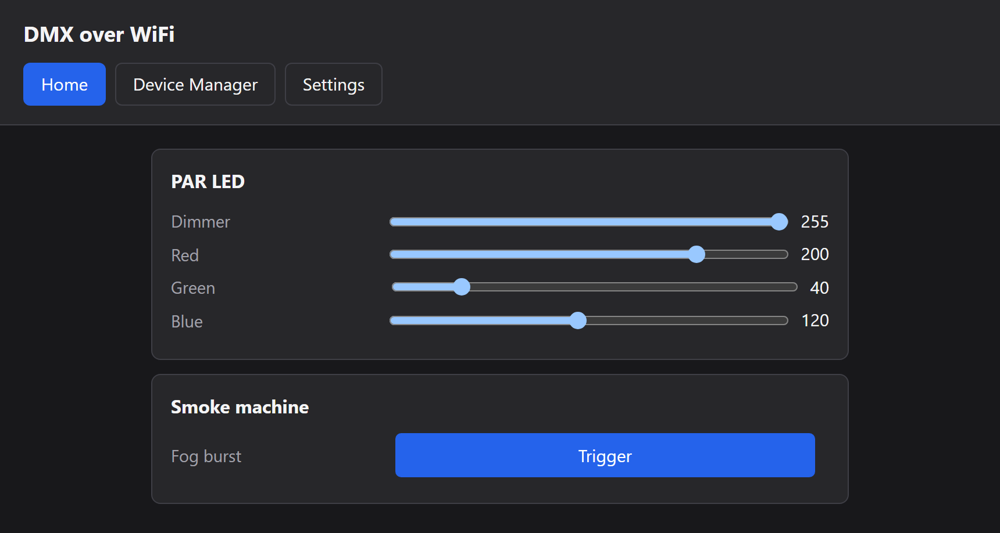
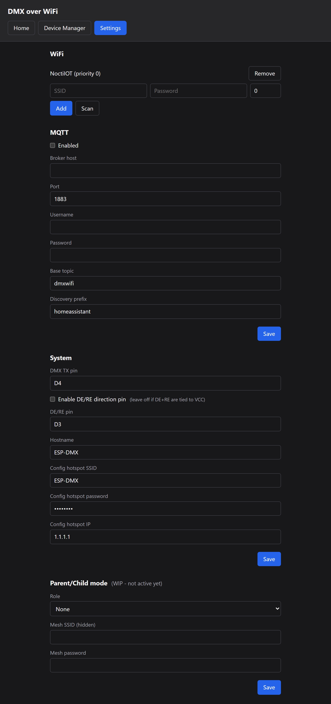

# DMX over WiFi (Mark II)

[](LICENSE)

A standalone DMX512 transmitter you configure and drive from a web browser. It
runs on an ESP32 or ESP8266 board, serves its own web UI, remembers several WiFi
networks, falls back to its own hotspot when none are in range, and can expose
every DMX channel to Home Assistant over MQTT.

> [!NOTE]
> **This is the C++ / PlatformIO rewrite of the Mark II.** The Mark II firmware
> was previously written in CircuitPython; it has been ported to C++ on the
> Arduino framework so it runs natively, uses far less RAM, keeps steadier DMX
> timing, and now builds for the **ESP8266** as well as the ESP32. The web UI,
> the REST API, the MQTT bridge and the serial console all carry over unchanged
> in behaviour. The original [ESPDMX](https://github.com/CestMoiRoma/ESPDMX) was
> an Arduino/ESP8266 WebSocket controller; this project is its successor.

## Contents

- [What it does](#what-it-does)
- [Hardware](#hardware)
- [Wiring](#wiring)
- [Getting started](#getting-started)
- [Build environments](#build-environments)
- [The web UI](#the-web-ui)
- [Channel types](#channel-types)
- [Timing and latency](#timing-and-latency)
- [Repository layout](#repository-layout)
- [Documentation](#documentation)
- [Roadmap](#roadmap)
- [License](#license)

## What it does

| | |
|---|---|
| **DMX output** | A full 512-channel universe, refreshed roughly 40 times a second, generated over UART with a proper break and mark-after-break |
| **Two board families** | One codebase builds for the ESP32-S2 (primary) and the ESP8266, with the board-specific DMX transmit path behind a small hardware abstraction layer |
| **Web UI** | Four pages served straight off the board: live control, fixture editor, settings, and an info page |
| **Fixtures and channels** | Group DMX addresses into named fixtures. Each channel is a fader or one of three kinds of button |
| **Multi-network WiFi** | Save several networks with priorities, so the same box works at home, at the venue and on tour |
| **Config hotspot** | With no known network in range the board starts its own access point, so the UI is always reachable |
| **Static or DHCP** | Take whatever address the router hands out, or pin a fixed one |
| **MQTT and Home Assistant** | Optional. Publishes auto-discovery configs, so every channel turns up as a `number`, `switch` or `button` entity |
| **Serial console** | A full text command set over USB. Configure, inspect and reboot the board without a browser |
| **Headless option** | A build flag drops the served UI while keeping the REST API, MQTT, WiFi and DMX, to save flash and RAM on the ESP8266 |
| **Parent and child mesh** | Present in the UI and the settings store. **Work in progress: stored only, no radio behaviour yet** |

## Hardware

- **An ESP32 or ESP8266 board.** Developed and tested on a **Wemos / Lolin S2
  Mini** (ESP32-S2, 4 MB flash, 2 MB PSRAM). Also builds for the **Wemos D1
  mini** (ESP8266); see [Build environments](#build-environments).
- **A MAX485 or similar RS-485 breakout**, the common blue module with
  `RO DI DE RE` down one side and `VCC A B GND` down the other.
- **A 3-pin or 5-pin female XLR** for the DMX output.
- A USB cable, and 5 V for the MAX485.

Output only for now. `RO` stays unconnected, so there is no DMX input and no RDM.
Changing that is the first item on the [roadmap](#roadmap).

The two chip families are not equal in what they can do. **[HARDWARE.md](HARDWARE.md)**
is the full capability comparison, board by board.

> [!NOTE]
> **ESP32 vs ESP8266.** On the ESP32 the DMX data pin is a configurable GPIO
> (`IO4` by default). On the ESP8266 the DMX output is fixed to `Serial1`
> (UART1 TX = **GPIO2**), so the tx-pin setting is only a label there. The
> ESP8266 is single-core and shares its CPU with the WiFi stack, which can add
> jitter to the DMX frame under network load; the ESP32 is the safer target for
> timing-sensitive rigs.

## Wiring



The picture is a Wemos D1 mini (ESP8266). The RS-485 side of the circuit is the
same on any board; take the DMX data signal from your board's TX pin (`IO4` on
the ESP32, `GPIO2` on the ESP8266) and wire the MAX485 as shown.

### Connections

| Microcontroller | MAX485 | Notes |
|---|---|---|
| DMX TX pin | `DI` | The DMX data line. `IO4` on the ESP32 (configurable), `GPIO2` on the ESP8266 (fixed) |
| `5V` | `VCC` | |
| `GND` | `GND` | |
| not wired | `DE` + `RE` | Tied together **to VCC** in this schematic, so the transceiver always transmits |
| not wired | `RO` | Transmit only, so nothing to receive |

| MAX485 | XLR pin | DMX signal |
|---|---|---|
| `GND` | 1 | Shield and common |
| `B` | 2 | Data minus |
| `A` | 3 | Data plus |

### About the DE/RE pin

The schematic ties `DE` and `RE` straight to VCC, so the transceiver always
transmits and the microcontroller has nothing to drive. That is the default in
this firmware, with `dmx_dir_pin_enabled` set to `false`.

If your wiring routes `DE` and `RE` to a GPIO instead, enable the direction pin
and name it:

- in the UI, under **Settings**, **System**, **Enable DE/RE direction pin**
- over serial, with `Set-System dir-pin enable=true pin=IO18`

Either way, reboot the board for a pin change to take effect.

## Getting started

### 1. Install PlatformIO

The firmware builds with [PlatformIO](https://platformio.org/). Install the CLI
(`pip install platformio`) or the VS Code extension. PlatformIO downloads the
board toolchains and the libraries (`ArduinoJson`, `PubSubClient`, and the
per-board DMX library) on the first build; nothing else needs installing by hand.

### 2. Get the code

```bash
git clone https://github.com/CestMoiRoma/DMXoverWifi.git
cd DMXoverWifi
```

### 3. Flash the firmware and the web assets

Pick the environment for your board (see [Build environments](#build-environments))
and flash. The firmware and the web UI are two separate uploads: the firmware,
and a LittleFS image built from `fsdata/`.

```bash
# ESP32-S2 (Wemos/Lolin S2 Mini)
pio run -e s2mini -t upload
pio run -e s2mini -t uploadfs
```

The web UI ships as a **single gzipped file**. `tools/pack_web.py` splices
`web/style.css` and `web/app.js` into `web/index.html` and compresses the result
before the image is packed, so loading the page is one request of about 15 KB
rather than three totalling 60 KB. The board answers one HTTP client at a time
and writes each response synchronously, so both the extra connections and the
extra bytes were time other requests spent queued behind it. Edit the three
files in `web/` normally; the packing happens at build time.

`uploadfs` builds the LittleFS image and writes it whole, so it **erases
everything the board had stored**, config included. A plain `upload` leaves the
filesystem alone, so re-run `uploadfs` only when the web assets change or when
you want to reseed the config from `.env`. Grab **Settings**, **Export .env**
first if the board holds anything you want to keep.

#### Seeding the config from `.env`

Copy `.env.example` to `.env` and fill in your WiFi, DMX pins and hotspot.
`tools/env_to_fsdata.py` runs before every build and turns that file into the
`data/*.json` the firmware reads at boot, so the board comes up already on your
network instead of on its hotspot. `.env` is gitignored, and so is the generated
`fsdata/data/`.

The file is the source of truth: it is rebuilt from scratch on every build, and
dropping a group from it drops that group from the image. Leave `.env` out
entirely and the firmware just falls back to its own defaults. The same file is
what **Settings**, **Export .env** hands back, so a config exported from one
board reflashes onto the next one unchanged.

### 4. Get it on the network

With no saved network, the board starts its own hotspot:

| | |
|---|---|
| SSID | `ESP-DMX` |
| Password | `DMX4ALL1` |
| Address | <http://1.1.1.1> |

Join it, open the page, go to **Settings**, **WiFi**, press **Scan**, add your
network and reboot. From then on the board joins that network at boot and the UI
lives at whatever address it gets.

The serial console does the same thing in one line:

```
Add-Wifi ssid="My Network" passwd="hunter2" priority=10
```

Or skip the hotspot altogether: put the network in `.env` before flashing, as
described above, and the board joins it on the first boot.

### 5. Add a fixture

Press the round **+** button, give the fixture a name and a DMX start channel, then
add its channels. A channel's *offset* is relative to the start channel, so a
fixture starting at 10 with a channel at offset 3 drives DMX address 12. Its
controls then appear on **Home**.

## Build environments

`platformio.ini` defines four environments:

| Environment | Board | Web UI | Use |
|---|---|---|---|
| `s2mini` | ESP32-S2 | yes | Primary target |
| `s2mini_headless` | ESP32-S2 | no | REST API + MQTT + DMX only |
| `d1mini` | ESP8266 | yes | Range extension |
| `d1mini_headless` | ESP8266 | no | Tightest RAM/flash footprint |

The `_headless` builds set `-D WITH_WEBUI=0`: they stop serving the HTML/JS/CSS
pages (and no longer need the `uploadfs` step) but keep the REST API, MQTT, WiFi
and DMX, so the box stays controllable over HTTP and MQTT. That trade is most
useful on the ESP8266, where RAM is tight.

Flash a specific environment with `pio run -e <name> -t upload`. The default
environment is `s2mini`.

## The web UI

### Devices

Every fixture with the right control per channel, and the tools to manage them,
on one page. Faders are live: the DMX buffer follows them **while you drag**,
not on release, and the controls open at the values the board is actually
holding rather than at zero.

That runs over a WebSocket on port 81 when the module is on, which also keeps
every open browser in sync as the rig moves. With the socket off or unreachable
the same controls fall back to plain HTTP on the same 30 ms schedule, so the
feel is the same and only the multi-client mirroring is lost.

Each card carries three icon actions in its top right corner:

| Icon | Does |
|---|---|
| Gear | Opens the fixture in the edit dialog and saves over it |
| Plus | Opens a copy in the dialog, preselecting the first start channel past the end of the source so the copy does not fight it for the same DMX addresses |
| Bin | Deletes the fixture, after a confirmation |

The round **+** button in the bottom right corner opens the same dialog for a
new fixture, with the start channel already past everything currently patched.

Two rows of chips sit above the fixtures: fixture **categories** on top, your
own **labels** below. Within a row, selecting several widens the selection, so
**Face** plus **Contre** shows both groups. Between rows they combine, so adding
**PAR** narrows that to the PARs among them.

Categories are a fixed list in the firmware (PAR, LED bar, Moving head, Scanner,
Strobe, Blinder, Laser, Smoke and haze, Dimmer pack, Effect, Other), picked when
a fixture is created. Labels are yours to invent. The category row only appears
once a rig actually spans more than one kind of machine.



### Settings

Six sub-pages:

- **Config** saves and restores the board's whole live config as a `.json` file,
  sets the DMX TX and DE/RE pins, and reboots the board. The DE/RE pin field only
  appears once the direction line is enabled, and the pin fields are hidden
  entirely on the ESP8266, where the output is nailed to Serial1 on GPIO2. The
  legacy `.env` export lives here too.
- **Labels** creates, renames, recolours and removes tags. Removing one clears it
  from every fixture that carried it, leaving their channels alone.
- **WiFi** holds the saved networks, the hostname and the fallback hotspot.
  Networks are tried from the top down: drag one to change the order, which *is*
  the priority. The gear on each opens its own settings, including whether that
  network uses DHCP or a fixed address, since a touring rig meets both.
- **API** switches the HTTP API, WebSocket and MQTT subsystems on or off,
  shows and regenerates the API key, and holds the full broker and Home
  Assistant discovery configuration.
- **Parent/Child** is the work-in-progress mesh section, stored only.
- **Info** shows the firmware version, the board, the mDNS name, the author, the
  repository and the serial console reference. The wiki link works offline too,
  because a copy of `WIKI.md` ships in the LittleFS image.



## Driving it over USB, with no radio at all

`Set-System wifi-toggle off`, or `WIFI_ENABLED=false` in `.env`, stops the board
bringing the radio up: no web server, no mDNS, no MQTT. A rig driven from a
laptop at front of house has no reason to broadcast, and this is how you say so.

The control surface then comes from the desktop app, which mirrors the web UI:

```bash
python tools/dmx_desktop.py            # finds the board's port itself
python tools/dmx_desktop.py --port COM5
```

It needs `pyserial`, and Tkinter, which ships with CPython on Windows and macOS
and is usually a separate `python3-tk` package on Linux. Note that PlatformIO's
own bundled Python has no Tkinter: run it with your system Python.

Two protocols share the one link because they want opposite things.
Configuration is read once through the console's `Get-Config`, which answers
with a line of JSON: readable, easy to debug, and speed is irrelevant. Channel
values go out as [binary frames](WIKI.md#binary-serial-protocol), which measured
about eleven times the update rate of the equivalent text command on an ESP32-S2
because they skip both the bytes and the string parsing.

## Channel types

Every channel picks one of four behaviours, set in the fixture dialog or over serial
with `mode=`.

| Type | On the Home page | Sends | In Home Assistant |
|---|---|---|---|
| `slider` | A 0 to 255 fader | The fader value | `number` |
| `button` | A **Trigger** button | 255 on each press | `button` |
| `button-momentary` | A **Hold** button | 255 while held, 0 on release | `button` |
| `button-switch` | An **On** and **Off** toggle | 255 or 0, latching | `switch` |

Use `slider` for dimmers and colour mixing, `button` for a one-shot like a fog
burst, `button-momentary` for anything that should stop when you let go, and
`button-switch` for things that stay on, like a heater or a lamp relay.

Over serial the mode accepts the obvious synonyms, so `momentary`, `hold`,
`toggle` and `switch` all land on the right type.

## Timing and latency

> [!WARNING]
> **Latency is not guaranteed.** The delay between moving a fader and the fixture
> reacting varies, and it can occasionally spike well past what feels acceptable
> for live work. Do not use this box where a late or dropped cue matters: pyro,
> moving trusses, anything safety related, or a show that has to hit an exact
> musical beat.

Where the jitter comes from:

- **WiFi is best effort.** Retries, interference, a busy access point or a
  roaming client each add tens to hundreds of milliseconds, unpredictably. Put a
  broker and Home Assistant on top and the tail gets longer.
- **One cooperative loop.** `loop()` polls the HTTP server, the MQTT client, the
  DMX refresh and the serial console in turn. Nothing preempts anything, so a
  slow request delays the next DMX frame. On the ESP8266 the single core is
  shared with the WiFi stack as well, which widens the tail.
- **The DMX frame is software timed.** The 25 ms refresh happens whenever the
  loop next comes round and enough time has passed, rather than on a timer
  interrupt.

Compared with the previous CircuitPython firmware, the native C++ build removes
the interpreter and its garbage-collector pauses, so the DMX frame is steadier
and the loop runs far tighter. It does not make WiFi arrival deterministic.

What is dependable: once a value reaches the DMX buffer it keeps going out at
roughly 40 frames a second, so fixtures hold their state and do not flicker. It
is the *arrival* of a new value that has no deadline.

If you need deterministic timing, drive your rig from a real lighting desk or an
Art-Net or sACN node on a wired network.

## Repository layout

```
platformio.ini          Build environments (s2mini / d1mini, full / headless)

src/
  main.cpp              Wiring-up and the main loop
  config.h              Build flags, per-board defaults, pin resolution
  version.h             Firmware version, shown on the Info page
  dmx/
    dmx_driver.{h,cpp}  512-channel buffer, 40 fps refresh, board-agnostic
    dmx_backend.h       Transmit backend interface
    dmx_backend_esp32.cpp    ESP32 transmit path (adapter over esp_dmx)
    dmx_backend_esp8266.cpp  ESP8266 transmit path (adapter over ESPDMX, Serial1)
  devices.{h,cpp}       Fixture and channel model, persistence, DMX addressing
  labels.{h,cpp}        Colour-coded tags fixtures reference by id
  ids.h                 Short prefixed random ids for fixtures and labels
  web_server.{h,cpp}    HTTP routes: the static UI plus the JSON API
  wifi_manager.{h,cpp}  Saved-network database, priority connect, AP fallback
  mqtt_manager.{h,cpp}  MQTT client and Home Assistant auto-discovery
  serial_console.{h,cpp} USB/UART serial command interpreter
  settings_store.{h,cpp} JSON config files on LittleFS, with defaults

web/                    The web UI as you edit it
  index.html
  style.css
  app.js

fsdata/                 Build output, gitignored in full. This is the LittleFS
                        image: www/index.html with the CSS and JS packed in,
                        a copy of the wiki, and data/*.json from `.env`

tools/
  pack_web.py           Pre-build script: web/ into one self-contained page
  env_to_fsdata.py      Pre-build script: `.env` to `fsdata/data/*.json`
  dmx_desktop.py        Tkinter control surface driving the board over USB

.env.example            Every key the seeding step understands
docs/images/            Wiring schematic and UI screenshots
```

Runtime config lives in `/data/*.json` on the board's LittleFS. The firmware
writes it as you change things, and a firmware `upload` leaves it alone, so your
WiFi, MQTT and fixtures survive a code change. `uploadfs` is the exception: it
replaces the whole partition with the built image, which is also how `.env`
seeding gets the config onto a fresh board.

## Documentation

**[HARDWARE.md](HARDWARE.md)** is the board and chip capability comparison: what
the ESP32 family and the ESP8266 can each do in this firmware, today and on the
roadmap.

**[WIKI.md](WIKI.md)** is the full reference:

- every serial command, with arguments and examples
- opening a serial session
- the HTTP JSON API
- MQTT topics and Home Assistant discovery
- troubleshooting

**[CONTRIBUTING.md](CONTRIBUTING.md)** covers the pull request workflow.

## Roadmap

Working today: DMX output on ESP32 and ESP8266, the web UI, the fixture model,
multi-network WiFi, hotspot fallback, static IP, MQTT with Home Assistant
discovery, the serial console, and the headless build option.

Nothing below is a promise, and the order is rough. Items marked **carried over**
were already on the [ESPDMX](https://github.com/CestMoiRoma/ESPDMX) roadmap.

### Getting DMX in and out

- **DMX input.** Wire `RO` and a direction pin so the board can *receive* a
  universe from a real lighting desk instead of only generating one. The point is
  the parent role below: one box patched into the desk, reading DMX and relaying
  it over WiFi to the child nodes, which output it locally. That turns the
  project into a wireless DMX distribution system rather than a standalone
  controller.
- **Several universes per board.** More than one MAX485 on the same ESP32, each
  on its own TX pin, each with its own 512-channel buffer. The fixture model
  already addresses channels within a device, so it mostly needs a universe field
  and a driver instance per output. Watch the frame budget: the main loop has to
  clock out every universe inside the same 25 ms window.
- **Art-Net and sACN input.** Accept a universe over the network from QLC+,
  Resolume, a grandMA on PC, or anything else that speaks the standard protocols,
  and put it on the wire. This is the shortest path to the box being useful
  alongside software people already run, and it shares most of its plumbing with
  DMX input.

### Talking between boards

- **ESP-NOW between parent and child.** Connectionless, no access point in the
  path, and far less latency and jitter than an HTTP or MQTT round trip. It is
  the right transport for relaying a live universe, and it keeps working when the
  venue WiFi does not. The obvious shape is ESP-NOW for the universe stream and
  the existing WiFi stack for configuration.
- **Parent and child mesh.** The UI, the serial command and the stored settings
  exist, but nothing acts on them yet. Blocked on the two items above, since a
  parent needs something to relay and something to relay it over.

### Hardware

- **A PCB version.** **Carried over.** ESP32 module, MAX485, XLR and power on one
  board instead of a breakout and jumper wires. Worth doing after the multi
  universe work lands, so the board can be laid out for the final number of
  outputs rather than redone later. Isolated RS-485 is worth the extra parts on
  anything that leaves the workshop.

### Control and interface

- **Scenes.** Save the current state of the universe under a name and recall it
  from the Home page, MQTT or the serial console. Cheap to build on the existing
  buffer and the single most useful thing missing for real use.
- **Emergency stop and a grand master.** A panic button and a global dimmer over
  every channel. Small, and expected on anything that drives lights.
- **Fixture profiles.** A small library of common layouts, such as a 4-channel
  RGBW PAR or an 11-channel moving head, so adding a fixture is picking a profile
  and a start address instead of typing channels by hand.
- **A WebSocket for live control.** The UI currently sends one HTTP request per
  fader movement, which is the largest avoidable part of the latency described
  above. A single socket carrying channel updates would cut it noticeably.

### Reliability and operations

- **Remember the last look.** The DMX buffer starts at zero on every boot, so a
  power blip blacks out the rig until someone opens the UI. An explicit save of
  the current state as the boot state avoids that.
- **Firmware update over the network.** OTA updates so the box can take a new
  build without a USB cable.
- **A watchdog.** If the main loop wedges, the rig freezes with its last frame
  and nothing recovers it. The hardware watchdog would reset the board instead.
- **Bring back the off-board test suite.** The CircuitPython line had 320 tests
  that ran the firmware on a PC against a fake ESP32. That harness was not carried
  into this rewrite; a host-compilable equivalent (native PlatformIO env, with
  the hardware behind the existing abstraction layers) would restore it.
- **Authentication.** There is none on the web UI or the API today, so keep the
  board on a network you trust.

## License

[PolyForm Noncommercial 1.0.0](LICENSE). In plain terms:

- **Noncommercial use is free**, including by schools, charities and public
  bodies.
- **Forks and modifications are welcome**, as long as the licence and the
  copyright notice travel with them, so credit stays attached.
- **Commercial use needs an agreement.** Open an issue and ask.

Contributions go through pull requests, and are licensed under the same terms.
See [CONTRIBUTING.md](CONTRIBUTING.md).

## Credits

Successor to [ESPDMX](https://github.com/CestMoiRoma/ESPDMX) by
[CestMoiRoma](https://github.com/CestMoiRoma). The wiring diagram comes from that
project. DMX output is driven by the
[esp_dmx](https://github.com/someweisguy/esp_dmx) library by Mitch Weisbrod on
the ESP32, and the [ESPDMX](https://github.com/Rickgg/ESP-Dmx) library by Rick on
the ESP8266.
